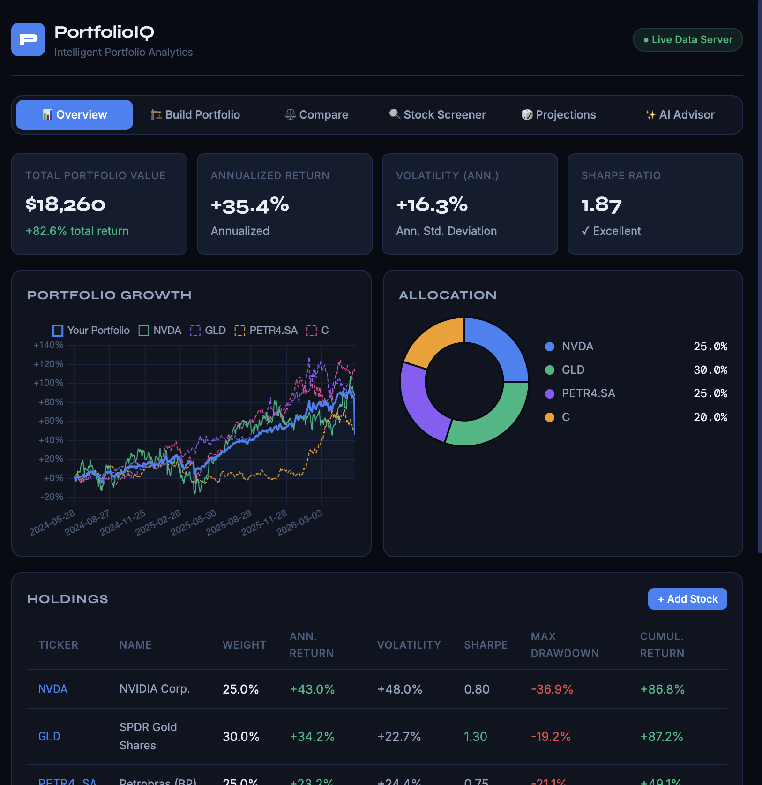
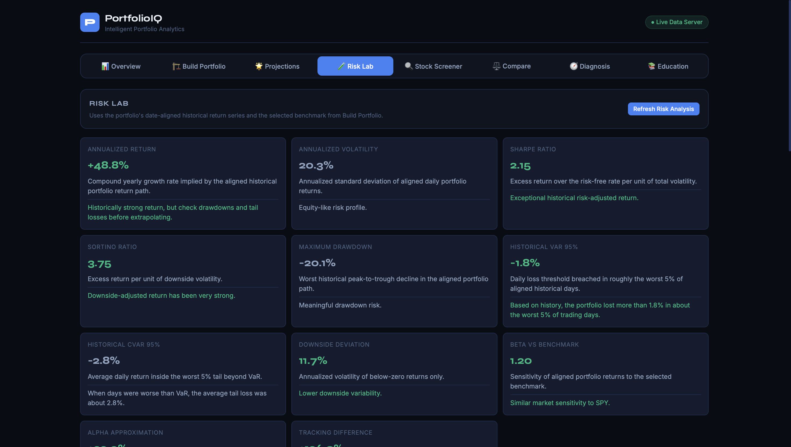
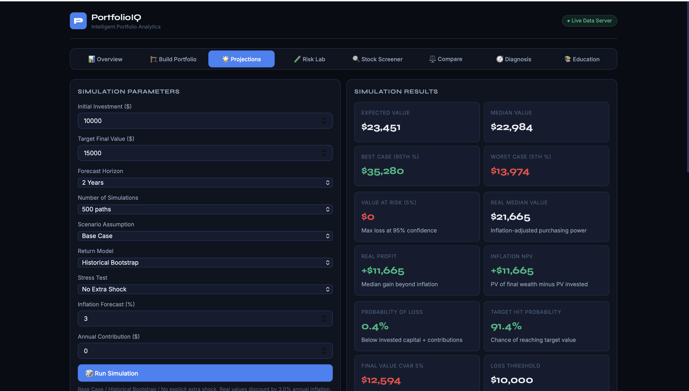
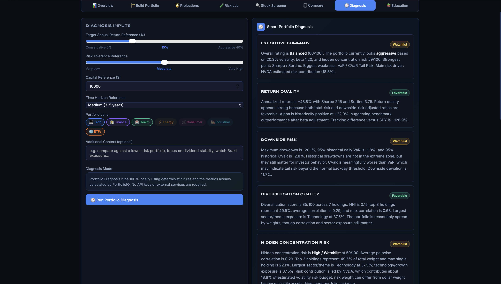

# PortfolioIQ

PortfolioIQ is a local portfolio analytics web application for building, analyzing, stress testing, and diagnosing investment portfolios. It combines live market data, quantitative finance metrics, Monte Carlo simulation, historical stress testing, and a fully local rule-based Portfolio Diagnosis engine.

The project is designed as a Finance + Statistics portfolio intelligence platform and runs without paid APIs or external AI services.

## Features

- **Portfolio Builder**
  - Add stocks, ETFs, Brazil tickers, and crypto tickers.
  - Set allocation weights and rebalance holdings.
  - Persist portfolio state locally between sessions.

- **Overview Dashboard**
  - Portfolio value, cumulative return, annualized return, annualized volatility, and Sharpe ratio.
  - Health score, allocation view, benchmark snapshot, income estimate, and holdings table.
  - Plain-English badges for return quality, risk level, and Sharpe quality.

- **Risk Lab**
  - Annualized return and volatility.
  - Sharpe ratio, Sortino ratio, max drawdown, downside deviation.
  - Historical VaR and CVaR / Expected Shortfall.
  - Beta, alpha approximation, and tracking difference versus a selected benchmark.
  - Drawdown, rolling volatility, rolling beta, and return distribution charts.

- **Hidden Concentration Risk Engine**
  - Detects portfolios that look diversified by ticker count but share the same underlying risks.
  - Uses HHI concentration, top holding weights, pairwise correlations, sector/theme exposure, beta, and estimated volatility contribution.
  - Produces a transparent hidden concentration score from 0 to 100.

- **Historical Stress Testing**
  - Replays the current portfolio through major crisis windows:
    - COVID Crash 2020
    - 2022 Rate-Hike Bear Market
    - 2018 Q4 Selloff
    - 2008 Financial Crisis, when enough history exists
  - Compares portfolio performance with a benchmark.
  - Shows worst drawdown, best/worst contributors, skipped holdings, and insufficient-history warnings.

- **Monte Carlo Projections**
  - Historical bootstrap, normal approximation, fat-tail stress model, and covariance matrix simulation.
  - Probability of loss, probability of reaching a target, percentile outcomes, and final value CVaR.
  - Inflation-adjusted outputs and assumption transparency.

- **Stock Screener**
  - Screens a stock/ETF universe with analytical metrics.
  - Sorts by market cap, expected return, volatility/risk, and Sharpe ratio.
  - Supports quick add and watchlist-style research flows.

- **Portfolio Diagnosis**
  - Fully local, deterministic, rule-based diagnosis.
  - No OpenAI key, AI API, or external AI service required.
  - Uses calculated portfolio metrics to generate:
    - Executive summary
    - Return quality analysis
    - Downside risk analysis
    - Diversification quality
    - Hidden concentration risk
    - Stress-test resilience
    - Simulation outlook
    - Suggested improvements
    - Transparent score breakdown

- **Education Center**
  - Plain-English explanations for portfolio and risk terms such as Sharpe, Sortino, VaR, CVaR, beta, correlation, HHI, Monte Carlo, and stress testing.

## Tech Stack

- **Frontend:** HTML, CSS, vanilla JavaScript
- **Charts:** Chart.js
- **Backend:** Node.js HTTP server
- **Data Source:** Yahoo Finance chart endpoint through the local backend
- **Storage:** Browser localStorage
- **Architecture:** Single-page local web app with a lightweight local data proxy

## Project Structure

```text
PortfolioIQ/
├── portfolio_analytics_platform.html   # Main frontend application
├── server.js                           # Local Node backend and Yahoo Finance proxy
├── package.json                        # npm start script
├── README.md                           # Project documentation
└── .gitignore                          # Local/generated file exclusions
```

## How to Run Locally

1. Clone the repository:

```bash
git clone <your-repository-url>
cd <repository-folder>
```

2. Start the local server:

```bash
node server.js
```

Or:

```bash
npm start
```

3. Open the app:

```text
http://localhost:4173/portfolio_analytics_platform.html
```

Use the `localhost` URL instead of opening the HTML file directly. The backend is needed because browsers block direct Yahoo Finance requests from frontend JavaScript.

## Screenshots

### Overview Dashboard



### Risk Lab



### Monte Carlo Simulator



### Portfolio Diagnosis



Additional screenshot ideas:

- Build Portfolio tab
- Historical Stress Testing
- Education / Glossary tab

## Quantitative Methodology

PortfolioIQ focuses on making portfolio risk understandable without hiding the underlying math.

### Return Series

Asset prices are converted into daily return series. Portfolio returns are calculated using date-aligned returns so that each portfolio return uses the same trading date across all selected holdings. This is important because different markets have different holidays and missing data patterns.

### Core Metrics

- **Annualized Return:** Compound annual growth rate implied by the selected historical return path.
- **Annualized Volatility:** Standard deviation of daily returns scaled to a yearly estimate.
- **Sharpe Ratio:** Excess return per unit of total volatility.
- **Sortino Ratio:** Excess return per unit of downside volatility.
- **Max Drawdown:** Worst peak-to-trough decline in the historical return path.
- **VaR / CVaR:** Historical tail-risk estimates for bad trading days.
- **Beta / Alpha:** Benchmark-relative sensitivity and return efficiency.
- **HHI:** Concentration measure based on squared portfolio weights.
- **Diversification Score:** A simplified score based on concentration and spread of exposures.

### Risk Lab

The Risk Lab uses historical aligned portfolio returns to measure downside risk, benchmark sensitivity, tail losses, drawdowns, rolling volatility, rolling beta, and return distribution characteristics.

### Hidden Concentration Risk

Hidden concentration risk is separate from simple diversification. A portfolio can have many tickers but still depend on the same sector, theme, factor, beta exposure, or correlated return driver. PortfolioIQ combines weight concentration, pairwise correlations, sector/theme exposure, beta concentration, and estimated volatility contribution into a score from 0 to 100.

### Historical Stress Testing

Stress testing estimates how the current portfolio weights would have performed during real historical crisis windows. Holdings without enough history are skipped and clearly reported. Results are historical approximations, not forecasts.

### Monte Carlo Simulation

The Monte Carlo simulator generates distributions of possible portfolio outcomes. It supports:

- Historical bootstrap sampling
- Normal approximation
- Fat-tail shock model
- Covariance-aware simulation

Outputs include probability of loss, probability of reaching a target, percentile outcomes, and final value CVaR. These results are scenario-based distributions, not predictions.

### Portfolio Diagnosis

The diagnosis system is deterministic and rule-based. It collects calculated metrics into a structured object and applies transparent thresholds to produce a professional portfolio report. This makes the diagnosis auditable and reproducible.

## Data Notes

- Market data is requested from Yahoo Finance through the local backend.
- Some tickers may have limited history or missing observations.
- Brazil tickers, crypto assets, ETFs, and US equities may have different trading calendars.
- The app shows warnings when data coverage is weak or insufficient.

## Financial Disclaimer

PortfolioIQ is an educational analytics project. It is not financial advice, investment advice, tax advice, or a recommendation to buy or sell any security. Historical performance, simulated outcomes, stress tests, and statistical estimates do not guarantee future results. Always do your own research and consult a qualified professional before making financial decisions.

## Roadmap Ideas

- Portfolio optimization and efficient frontier construction
- Factor exposure analysis
- Rolling correlation heatmaps
- Scenario builder for custom macro shocks
- Exportable PDF reports
- Larger dynamically cached stock universe
- More robust benchmark and sector classification data
